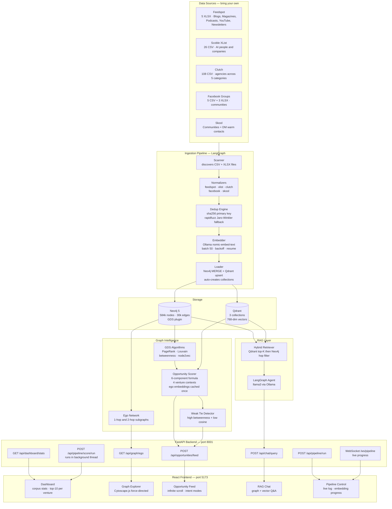
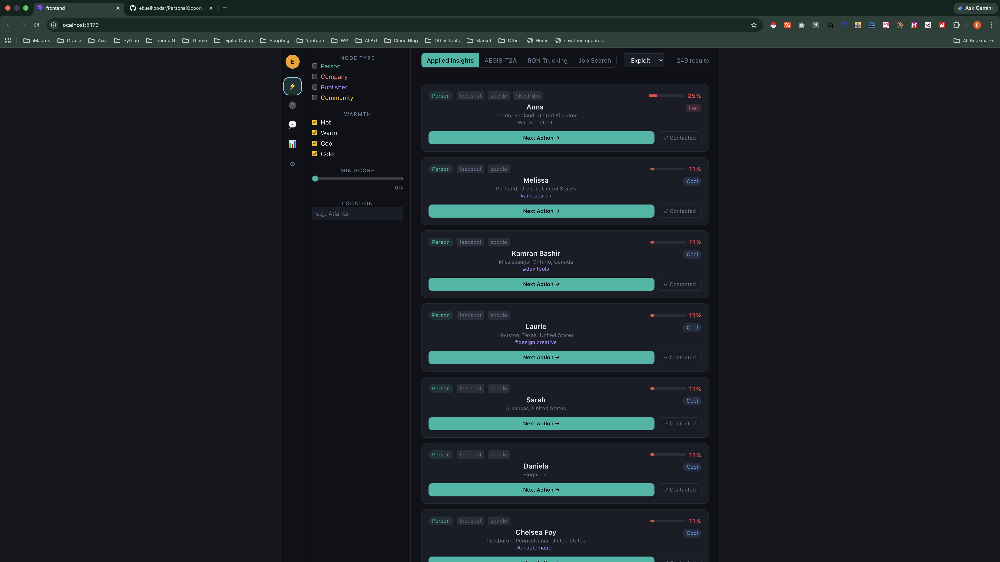
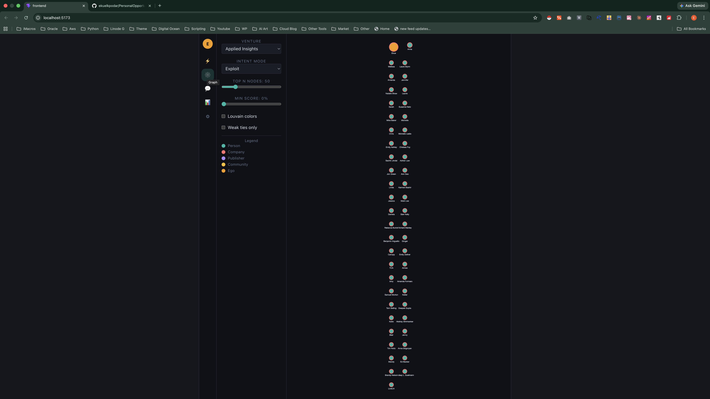
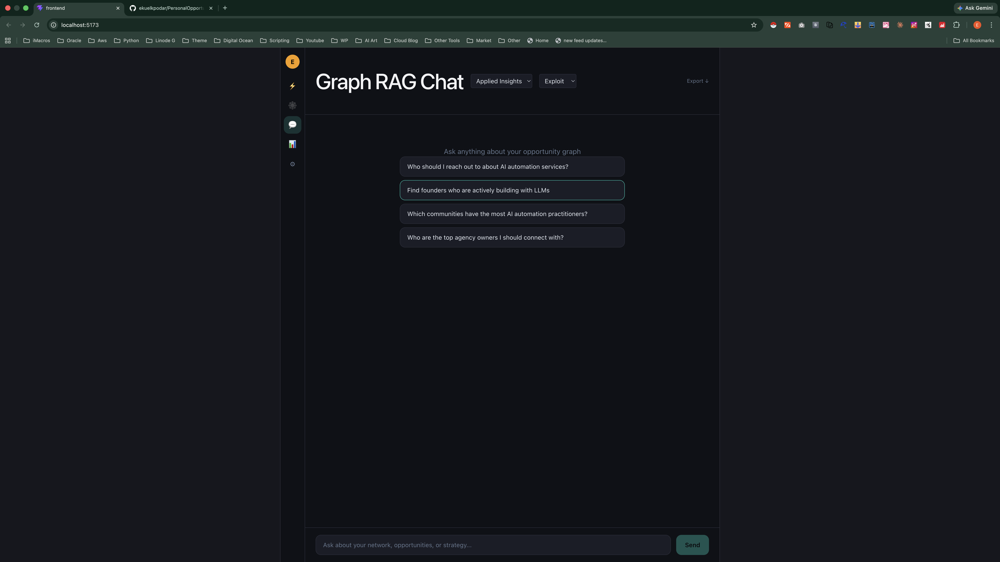
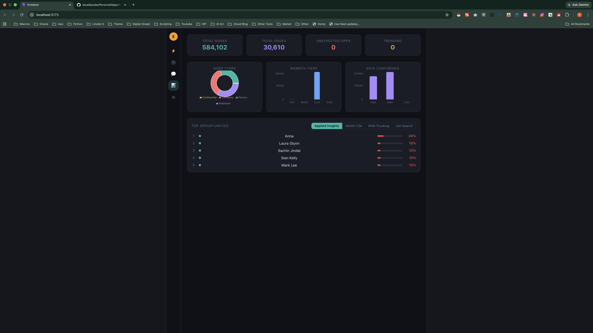

# Personal Opportunity Graph

A full-stack, locally-hosted network intelligence tool that ingests ~274k rows across 5 XLSX/CSV data sources, normalizes them into a graph database (Neo4j) and vector database (Qdrant), computes multi-dimensional opportunity scores, and surfaces the results through a modern web UI.

Built for a single ego node — you — to answer the question: **"Who in my network should I reach out to, and why?"**

---

## System Architecture



### Architecture Flowchart



---

## UI Screenshots

### Dashboard — Corpus Stats and Top Opportunities


### Opportunity Feed — Ranked by Score


### Graph Explorer — Force-Directed Network


### RAG Chat — Graph-Aware Q&A


---

## How to Run — Step by Step

### Step 1 — Prerequisites

Install the following before you begin:

| Tool | Version | Link |
|---|---|---|
| Docker Desktop | Latest | [docker.com/products/docker-desktop](https://www.docker.com/products/docker-desktop/) |
| Python | 3.11+ | [python.org](https://www.python.org/downloads/) |
| Node.js | 18+ | [nodejs.org](https://nodejs.org/) |
| Git | Any | [git-scm.com](https://git-scm.com/) |

Verify everything is installed:
```bash
docker --version
python3 --version
node --version
git --version
```

---

### Step 2 — Clone the Repository

```bash
git clone https://github.com/ekuelkpodar/PersonalOpportunityGraph.git
cd PersonalOpportunityGraph
```

---

### Step 3 — Add Your Data Files

This repo does **not** include data files. Place your own exports in the following structure inside the project root:

```
feedspot/
  _BloggerOutreach_Blogs_FullDB_*.xlsx
  _BloggerOutreach_Magazines_FullDB_*.xlsx
  _BloggerOutreach_Podcasts_FullDB_*.xlsx
  _BloggerOutreach_Youtube_FullDB_*.xlsx
  _BloggerOutreach_Newsletters_FullDB_*.xlsx

XList/
  AI Artists.csv
  AI Community #1 of 7.csv  ... (all 26 CSV exports)
  AIcompanies-1.csv
  AIcompanies-2.csv  ... (company files)

Clutch/
  DigitalMarketing Clutch/  ... (CSV files)
  Development Clutch/
  Design Clutch/
  BusinessServicesClutch/
  ITservicesClutch/

FacebookGroups/
  FacebookTrucking.csv
  bisnesses-1.csv
  oracle_facebook_groups.xlsx
  SQL_Facebook_Groups_Cleaned.xlsx
  facebook-3.xlsx

Skool/
  SkoolCommunities.csv
  SkoolDM.csv
```

> Exact column schemas are documented in `backend/config.py`.

---

### Step 4 — Configure Your Ego Node

Open `backend/config.py` and update the ego section with your own identity and ventures:

```python
EGO_ID       = "ego:you"
EGO_NAME     = "Your Name"
EGO_LOCATION = "City, State"

EGO_VENTURES = [
    "Venture 1 (short description)",
    "Venture 2 (short description)",
]

EGO_SKILLS = ["skill1", "skill2", "skill3"]

EGO_INTERESTS = ["topic1", "topic2"]

# Plain-text descriptions used for embedding — be specific
EGO_VENTURE_CONTEXTS = {
    "venture_1": "Full sentence description of venture 1 for semantic matching...",
    "venture_2": "Full sentence description of venture 2 for semantic matching...",
}
```

---

### Step 5 — Start All Services

```bash
chmod +x start.sh
./start.sh
```

This script does the following automatically:

| Step | What happens |
|---|---|
| 1 | Starts Neo4j, Qdrant, and Ollama via Docker Compose |
| 2 | Waits for Neo4j to become healthy |
| 3 | Pulls `nomic-embed-text` and `llama3` models into Ollama |
| 4 | Creates a Python virtual environment and installs all dependencies |
| 5 | Starts the FastAPI backend on **http://localhost:8001** |
| 6 | Starts the React frontend on **http://localhost:5173** |

> If Docker is not running, start Docker Desktop first, wait for the whale icon to appear, then run `./start.sh`.

You can also start services manually if needed:

```bash
# Docker services only
docker-compose up -d

# Backend only (in a separate terminal)
.venv/bin/uvicorn backend.main:app --host 0.0.0.0 --port 8001 --reload

# Frontend only (in a separate terminal)
cd frontend && npm run dev
```

---

### Step 6 — Run the Ingestion Pipeline

1. Open **http://localhost:5173** in your browser
2. Click the **Pipeline** tab (lightning bolt icon in the sidebar)
3. Click **Run Pipeline**
4. Watch live progress stream via WebSocket — each source is processed in order:
   - Feedspot (publishers + authors)
   - XList / Scoble (people + companies)
   - Clutch (agencies)
   - Facebook Groups (communities)
   - Skool (communities + DM warm contacts)
5. Wait for the pipeline to complete — this takes several minutes depending on your data volume

> The pipeline is resumable. If it stops, re-running it will skip already-processed files.

---

### Step 7 — Run the Scoring Job

After ingestion is complete:

1. Still on the **Pipeline** tab, click **Run Scoring**
2. The job runs in the background — the UI stays responsive
3. Opportunity scores are written to Neo4j as they are computed
4. Switch to the **Dashboard** or **Opportunity Feed** and refresh — results populate as scoring progresses

Scoring computes a 6-component score for every node across all 4 venture contexts:

```
opportunity_score =
  0.30 × relevance      (cosine similarity to your venture embedding)
+ 0.25 × reachability   (graph path length + warm edges + shared communities)
+ 0.15 × influence      (normalized PageRank)
+ 0.15 × responsiveness (warmth tier: DM contact = 1.0, cold = 0.0)
+ 0.10 × confidence     (data completeness)
+ 0.05 × novelty        (betweenness centrality × inverse similarity)
```

---

### Step 8 — Explore Your Network

| Page | How to use it |
|---|---|
| **Dashboard** | See corpus totals, warmth distribution, and top-10 scored contacts per venture |
| **Opportunity Feed** | Browse ranked contacts. Filter by node type, warmth tier, location. Switch ventures and intent modes at the top |
| **Graph Explorer** | Click any node to expand its connections. Nodes are colored by Louvain community. Weak ties are highlighted |
| **RAG Chat** | Type a natural language question like "Who should I pitch my AI governance platform to?" |
| **Pipeline** | Re-run ingestion or scoring at any time. Scoring runs nightly automatically at 2am |

---

### Step 9 — Intent Modes

Use the intent mode selector in the Opportunity Feed to reweight scores for different goals:

| Mode | Best for |
|---|---|
| **Exploit** | Reach out to warm, reachable contacts most likely to respond |
| **Explore** | Discover high-influence strangers outside your current network |
| **Bridge** | Find weak-tie nodes that connect different communities |
| **Recruit** | Surface people aligned with your venture's domain |
| **Sell** | Prioritize reachable contacts for outreach |

---

### Troubleshooting

| Problem | Fix |
|---|---|
| `ERR_CONNECTION_REFUSED` on :5173 | Frontend died — run `cd frontend && npm run dev` |
| `ERR_CONNECTION_REFUSED` on :8001 | Backend died — run `.venv/bin/uvicorn backend.main:app --port 8001` |
| Ollama embedding errors | Run `docker exec pog-ollama ollama pull nomic-embed-text` |
| Neo4j connection refused | Run `docker-compose up -d pog-neo4j` and wait 30s |
| Port 8000 already in use | The config uses port 8001 by default — no action needed |
| Opportunity Feed shows 0 results | Scoring hasn't run yet — go to Pipeline tab and click Run Scoring |
| Dashboard shows no top opportunities | Click Run Scoring — scores must exist before they appear |

---

## Node Types

| Label | Source | Key Fields |
|-------|--------|------------|
| `:Person` | XList, Feedspot, Skool DMs | x_handle, bio_raw, scoble_lists, warmth_score |
| `:Company` | XList, Clutch | services_raw, primary_service, clutch_category, hourly_rate |
| `:Publisher` | Feedspot | site_url, domain_authority, reach_score, category_type |
| `:Community` | Facebook, Skool | platform, member_count, daily_posts, visibility |
| `:Ego` | Config | ventures, skills, interests, target_roles |

## Edge Types

| Relationship | From — To | Weight |
|---|---|---|
| `HAS_AUTHOR` | Publisher — Person | 1.0 |
| `WORKS_AT` | Person — Company | 0.7 |
| `AFFILIATED_WITH` | Person — Company | 0.5 |
| `MEMBER_OF` | Ego — Community | 1.0 |
| `WARM_CONTACT` | Ego — Person | 1.0 |
| `IN_COMMUNITY` | Person — Community | 0.8 |
| `IN_SCOBLE_LIST` | Person/Company — list | categorical |
| `OPPORTUNITY_SCORE` | Ego — any | computed |

---

## Tech Stack

| Layer | Technology |
|---|---|
| Graph DB | Neo4j 5 + GDS plugin (PageRank, Louvain, node2vec) |
| Vector DB | Qdrant (3 collections, 768-dim) |
| LLM / Embeddings | Ollama — `nomic-embed-text` + `llama3` |
| Pipeline | LangGraph + Python 3.11+ |
| Backend | FastAPI + WebSocket progress streaming |
| Frontend | React 18 + Vite + TailwindCSS + Cytoscape.js + Recharts |
| Scheduling | APScheduler (nightly scoring at 2am) |
| Infra | Docker Compose (Neo4j, Qdrant, Ollama) |

---

## Project Structure

```
PersonalOpportunityGraph/
├── backend/
│   ├── main.py                  FastAPI entry point + APScheduler
│   ├── config.py                All paths, DB connections, scoring weights
│   ├── models.py                Pydantic models + node dataclasses
│   ├── utils.py                 ID gen, text cleaning, infer_category_type
│   ├── pipeline/
│   │   ├── orchestrator.py      LangGraph pipeline + WebSocket progress
│   │   ├── scanner.py           Discovers CSV + XLSX files across all sources
│   │   ├── dedup.py             sha256 + rapidfuzz Jaro-Winkler
│   │   ├── embedder.py          Batch Ollama /api/embed, batch 50, resume
│   │   ├── loader.py            Neo4j MERGE + Qdrant upsert
│   │   └── sources/
│   │       ├── feedspot.py      5 XLSX, multi-sheet, V1/V2 schema detection
│   │       ├── xlist.py         Person + Company CSV files
│   │       ├── clutch.py        5 subdirectory categories
│   │       ├── facebook.py      CSS-scraped CSV + structured XLSX
│   │       └── skool.py         Communities + DM warm contacts
│   ├── graph/
│   │   ├── gds.py               PageRank, Louvain, betweenness, node2vec
│   │   ├── scorer.py            6-component scoring, ego embeddings cached once
│   │   ├── qdrant_client.py     Qdrant wrapper, auto-creates collections
│   │   ├── ego_network.py       1-hop/2-hop subgraph extraction
│   │   ├── weak_ties.py         Bridge node detection
│   │   ├── reachability.py      Path-length + warmth reachability
│   │   └── temporal.py          Trend signals + recency decay
│   ├── rag/
│   │   ├── retriever.py         Hybrid Qdrant top-K then Neo4j hop filter
│   │   └── agent.py             LangGraph RAG agent (llama3)
│   ├── action/
│   │   ├── engine.py            Next Best Action generator
│   │   ├── drafts.py            Outreach draft cache
│   │   └── routing.py           Channel routing logic
│   ├── feedback/
│   │   └── loop.py              Interaction logging + score adjustment
│   └── api/
│       ├── dashboard.py
│       ├── opportunities.py
│       ├── graph.py
│       ├── chat.py
│       ├── pipeline.py          Scoring runs in background thread
│       ├── actions.py
│       ├── feedback.py
│       └── websocket.py
├── frontend/
│   └── src/
│       ├── App.tsx
│       └── components/
│           ├── Dashboard.tsx
│           ├── GraphExplorer.tsx
│           ├── OpportunityFeed.tsx
│           ├── RagChat.tsx
│           ├── PipelineControl.tsx
│           ├── ActionDrawer.tsx
│           └── ScoreRadar.tsx
├── Image/
│   ├── opportunity_graph_system_architecture.svg
│   ├── Dashboard-1.png
│   ├── Dashboard-2.png
│   ├── Dashboard-3.png
│   └── Dashboard-4.png
├── docker-compose.yml
├── requirements.txt
├── start.sh
└── README.md
```

---

## Service URLs

| Service | URL |
|---|---|
| Frontend | http://localhost:5173 |
| Backend API | http://localhost:8001 |
| API Docs (Swagger) | http://localhost:8001/docs |
| Neo4j Browser | http://localhost:7474 |
| Qdrant Dashboard | http://localhost:6333/dashboard |

---

## License

MIT
